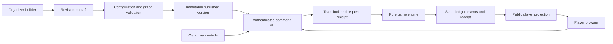

# Architecture

V2 has one authoritative game engine. A private published `HuntDefinition` describes the experience; a persisted `GameState` describes a team's progress; a redacted `PlayerView` describes what the participant may see now. React renders that view and submits commands. It never writes points, answers or checkpoint state directly to a database.

## Boundaries

| Location | Responsibility |
| --- | --- |
| `lib/engine/types.ts` | Private/public definitions, commands, progress, scoring, hints and controls. |
| `lib/engine/validation.ts` | Strict shape/field validation, graph edges, cycles/reachability, prerequisites, media URLs, puzzle configuration and command/control parsing. |
| `lib/engine/engine.ts` | Pure initialization, traversal, action registry, hint purchasing, puzzle saves, fallback and organizer transitions, public projection. |
| `lib/engine/puzzles/` | Puzzle configuration/state/public contracts, validators and nine independent module implementations. |
| `lib/server/store.ts` | Team sessions/membership, version-pinned state loading, row locks, receipts and atomic command persistence. |
| `lib/server/hunts.ts` | Draft revisions, publication/versioning, lifecycle and schedule/registration gates. |
| `lib/server/operations.ts` | Isolated previews, simulations, help/replies, announcements, leaderboard and analytics. |
| `lib/server/media.ts` | Authenticated asset/photo storage, derivatives, jigsaw cutting, access and retention. |
| `lib/server/security.ts`, `http.ts` | Hashed sessions/PINs, roles, origin checks, bounded requests and friendly error mapping. |
| `app/api/v2/` | Thin server adapters; privileged endpoints authenticate the organizer independently. |
| `components/v2/builder/` | Visual/form authoring, graph connections, settings, checkpoint/hint/puzzle fields and operations UI. |
| `app/v2/page.tsx`, `components/v2/player/`, `puzzles/` | Public runner, lazy capabilities, recovery, maps/camera/photo/help and puzzle renderers. |

## Definitions and flows

A hunt contains checkpoints. Each checkpoint has an ID, title, base points, optional grouping/prerequisites/location/scoring rules, hints, and a flow with a start node and explicit edges. Node names are implementation details; the participant sees prompts and actions.

Interactive nodes include text/media display, QR, code, answer, GPS, path choice, puzzle, camera guidance, organizer verification and photo verification. Automatic nodes set a variable, branch on a condition, choose a weighted route, add/deduct points, or complete the checkpoint. Every reachable route terminates in `complete`; malformed or cyclic definitions cannot publish. Wrong answers retry within the active action rather than traversing a graph cycle. Automatic traversal is bounded and does not recurse once per node.

A fallback is an additional configured edge on an interactive node. Its default availability is in the published definition; a team's live enable/disable flag is in state. Choosing it records the recovery and skips the original action. This lets organizers recover a destroyed QR without mutating the definition used by active teams.

Variable conditions compare a bounded string/number/boolean. Other conditions check a completed checkpoint, a purchased hint, or a daily UTC `HH:MM` interval, including intervals crossing midnight. Weighted branches are deterministic for the same team/checkpoint/node, so refresh or retries do not reroll a route. There is no arbitrary scripting or code execution in organizer configuration.

## Checkpoint access and completion

Supported modes are sequential, open selection and prerequisite-based. Prerequisites also describe hubs and branching paths. Checkpoints explicitly distinguish locked, available, in-progress, completed and skipped. A team has one selected checkpoint at a time, but unfinished work in another available checkpoint stays saved.

Required checkpoints default to true. Optional checkpoints do not prevent the hunt's required objective from finishing. The server records `completedAt` when that objective is first reached. A team may then select an optional challenge; its original required finish time remains available even while that bonus is active. Skipped required checkpoints satisfy access/completion after an organizer's logged intervention and apply the configured skip penalty, without awarding the normal base points.

Only the engine reaching the terminal action awards completion. A participant cannot send `complete_checkpoint` or use Continue to bypass verification.

## Transactions and idempotency

Every game mutation follows the same server boundary:

1. Authenticate the team or organizer session and bind it to the addressed team.
2. Start a PostgreSQL transaction and lock that team's row.
3. Load the immutable version recorded in its state.
4. Resolve the `(team_id, request_id)` receipt. Same ID and payload returns the original feedback with the newest public state; different payload is rejected.
5. Run the pure command/control against the freshly locked state.
6. Commit state, ledger/events and receipt together.

Commands identify the expected checkpoint/action. A delayed answer to an earlier action cannot advance a later one. Hint purchases additionally deduplicate by hint ID. Browser retries retain the original request ID across refresh and lost responses. Independent devices receive independent session tokens but lock/update the same team aggregate.

Puzzle saves carry an additional **per-puzzle revision**. An outdated device cannot overwrite a newer puzzle state. Both `save_puzzle` and `submit_puzzle` validate player input and persist state; only submission with the module's successful result advances. Equivalent commands apply to hint puzzles. Puzzle renderers currently submit purposeful moves, so the final correct move can finish naturally. Resetting a puzzle or reopening its checkpoint advances that revision generation. Resetting/rebuying a puzzle hint also preserves generation, preventing old queued edits from overwriting the new puzzle.

## Hints and scoring

One hint engine owns IDs, costs, usage and availability. Content types are text, image, audio/video, map, camera/direction guidance and puzzle. A puzzle hint uses the same puzzle registry and player renderer as a challenge, but reveals its reward only after successful submission. Private solution/configuration and an unsolved reward are excluded from `PlayerView`.

Availability can require prior hints, elapsed seconds since checkpoint start, or completion of a particular node such as GPS. Presentation order is an array order; purchase identity never comes from a hint count.

The score equals the sum of ledger entries. Entries identify checkpoint and optional action/hint, amount, time, reason and, for compensation, the reversed entry. Current causes include base completion, hint charge, wrong-attempt penalty, skip penalty, time bonus, configured action points, decoy discovery, organizer adjustment and refund. Negative interim totals are allowed; completion adds the full base value without subtracting hints again.

Organizer adjustments append entries. Reset hint refunds its active charge. Reopening a completed checkpoint compensates its completion/time/action bonuses and skip penalty, then permits a fresh playthrough; hint charges and wrong attempts remain part of history. A simple action reset cannot farm an automatic bonus.

## Media, camera and image verification

Theme configuration is a set of validated tokens rather than injected CSS: primary color, logo/cover/background images, typography, button shape, checkpoint badge style and success animation. The player keeps solid readable surfaces over decorative backgrounds, selects contrasting primary-button text, and suppresses effects when reduced motion is requested. Uploaded theme assets use the same explicit media-reference authorization as other visible player content.

Media is stored on the server filesystem or shared persistent volume. Images are oriented, resized to at most 1600×1600 and re-encoded as JPEG; browser photos are compressed before upload too. Jigsaws can be cut into individual image assets, keeping the private answer order server-side. Audio/video is validated by allowed type/signature and bounded upload size; it is not transcoded.

Access-controlled asset URLs are served only to an organizer or a team whose current public view contains them; deliberately public hunt covers/logos are readable before joining. Photos are private to their team and organizer, associated with checkpoint/action, and checked again before submission. Configured photo GPS requirements are enforced by the upload adapter. `submit_photo` then records a pending media ID; it does not declare visual success.

Photo verification currently uses human review. Approve/reject are organizer controls with a reason and exact team revision. Review responses and delayed retries cannot operate on a later action. Default retention is after verification; after-event and retained modes are configurable. Expiry is enforced when reading; request-triggered cleanup and the separate 60-second maintenance service remove expired files/records. Generic Node hosting can run the same maintenance script as a process or periodic one-shot job. The reusable organizer asset library is separate from event photos. Unused assets can be deleted only after checking references in all drafts and published versions, serialized against publication.

Camera guidance is a lightweight reference overlay with optional user-requested distance/compass information. It does not claim automatic recognition, alignment confidence or GPS proof of an exact object. An automated vision adapter can later produce results through the same pending workflow; no large model runs on the phone today. See [extensions](extensions.md).

## Drafts, versions, previews and operations

Drafts can be incomplete and carry optimistic revisions; save conflicts do not overwrite another window. Publication validates the full definition and creates a new immutable `hunt_versions` record. Existing teams remain on their recorded version; new teams use the latest. Status and safe team runtime controls are independent of the published graph.

The event lifecycle is Ready → Live ↔ Paused → Ended → Archived, with supported reopen/restore transitions validated server-side. Schedules and closed registration are enforced by the API. The organizer can approve/skip/reset actions, skip/revisit checkpoints, adjust scores, refund hints, enable fallback, review photos, answer help and send announcements. Interventions remain auditable.

Preview teams use a separate cookie and local-storage namespace. Draft previews get their own unpublished-to-players hunt; published-hunt previews also remain flagged. They are excluded from real leaderboard/analytics. Authorized simulation records its derived target and request so a lost response cannot simulate success twice on successive actions. QR/wrong answer, GPS, hints, fallback and checkpoint jumps use the ordinary engine.

Relevant screens poll while visible: team state, organizer dashboard, help, leaderboard and photo review. No permanent progress is inferred from whether a poll succeeded. Leaderboard visibility is enforced server-side for live/hidden/finish-only settings, with points, progress or points+time sorting and shared ranks for equal results.

## Persistence and security

`hunt_v2` is private, has revoked public grants, and enables row-level security on its tables. The server database role owns the schema. Never expose that role in a `NEXT_PUBLIC_` value or public PostgREST schema.

The schema separates hunts/versions/drafts, teams/members, sessions, receipts, preview receipts, help/messages, media and organizer audit. Per-team progression, hints, ledger, events and puzzle states form one atomic JSON aggregate. This is not full event sourcing: state is authoritative; the ledger/audit explain how it changed.

PINs use salted scrypt; session tokens are random and stored as SHA-256 hashes. Cookies are HttpOnly and SameSite=Lax. The Secure flag follows the request Origin, falling back to `APP_ORIGIN`, so separately configured local HTTP and public HTTPS access can coexist. Organizer credentials are configured server-side, with a 12-hour session; team sessions last seven days. Mutation requests require the configured exact Origin or an explicitly listed `ADDITIONAL_ORIGINS` value; no wildcard origin is accepted. Errors sent to players are mapped to useful messages.

Legacy pages are disabled unless explicitly enabled. Current deployment does not need Supabase or Vercel. Old V1 database policies are a separate migration/retirement concern, documented in [migration](migration.md).

## Verification and limits

Player feedback is a presentation of confirmed server state. Detailed errors stay beside their action and are associated with answer inputs; a viewport notification announces the result once. Actual task/completion/score changes trigger brief visual cues. Partial puzzle saves remain quiet, and incorrect text/choice attempts are distinguished from successful solutions even though both persist puzzle state. Sound is off until the player enables it, stored only as a browser preference, and unlocked during a user gesture. Loading saved state or polling never plays a success tone. Reduced-motion preferences and an explicit still-animation theme suppress visual motion.

Unit tests exercise module/graph/secret/idempotency/recovery behavior; PostgreSQL tests establish actual locking/receipt/version/media guarantees; browser journeys establish rendered behavior against the API. None substitutes for physical mobile camera/sensor testing or a verified public HTTPS deployment. The [acceptance register](acceptance.md) maps each product-plan requirement to current evidence and remaining gaps.

Full offline page installation/synchronization, native apps, full 3D mapping and automated embeddings/feature matching/VLM recognition are not shipped features. Cached current content, queued requests, puzzle/photograph drafts and clear reconnect behavior cover ordinary connection failures while the browser application is available.
